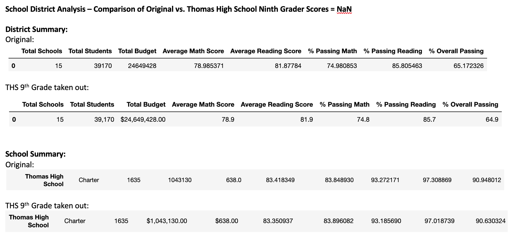
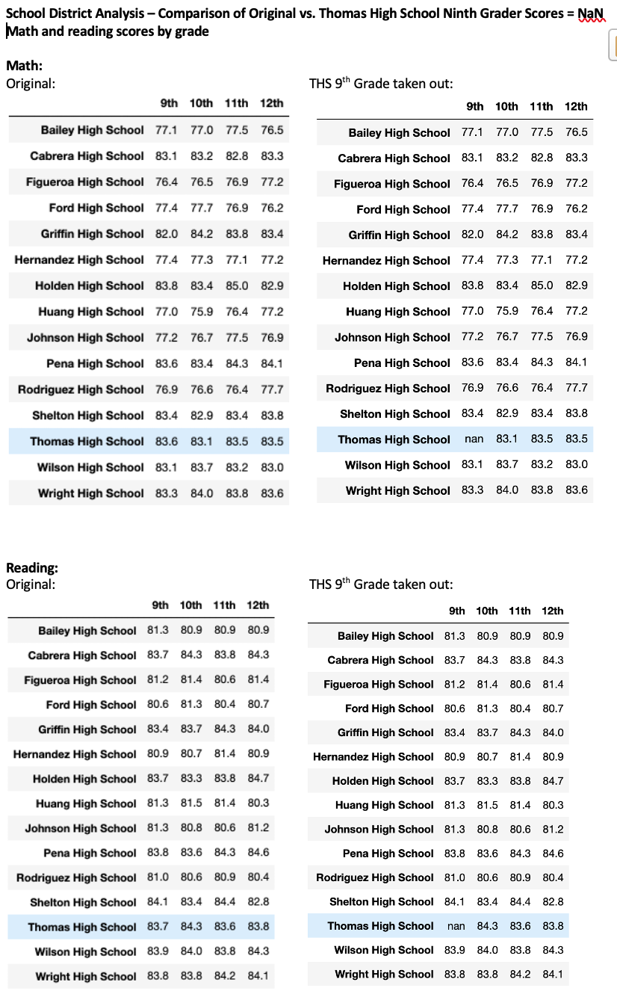
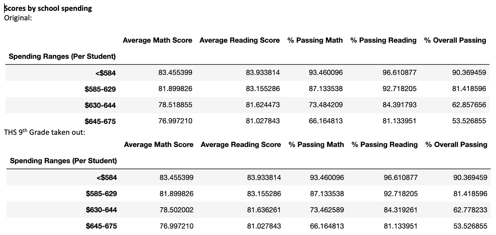
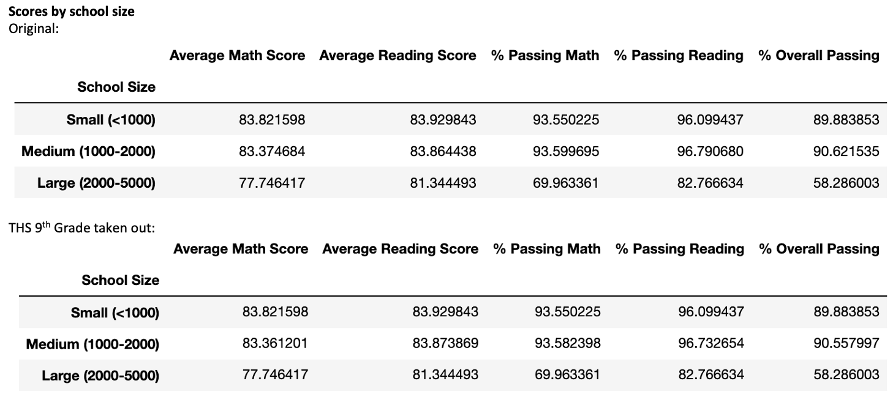
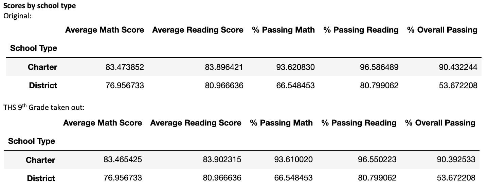

# School_District_Analysis
## Overview of the school district analysis
The purpose of this analysis was to see the changes to various summaries after taking out the reading and math grades for the ninth graders of Thomas High School (THS). The ninth grade reading and math grades appeared to be altered and the altered grades were affecting the summaries that are given to the school board. The school district analysis was performed a second time while replacing the math and reading scores of the ninth graders of THS with NaNs. 
## Results
A comparison was made between the original school district analysis and a new school district analysis which removed the ninth grade scores from THS. For most of these comparisons, we will be looking at the results prior to formatting as that gives more detail than looking at the formatted version which has fewer decimal points. See the tables at the end of this report, after the summary. 
- How is the district summary affected?
  - For the district summary, the % passing math, % passing reading and % overall passing decreased by approximately one tenth of a percent when taking out the THS ninth graders. 
- How is the school summary affected?
  - For the school summary, specifically for THS, the average math score decreased by six hundredths. The average reading score increased by five hundredths. The % passing math decreased by one tenth, the % passing reading decreased by two tenths and the % overall passing decreased by three tenths. 
- How does replacing the ninth graders’ math and reading scores affect THS’s performance relative to the other schools?
  - Replacing the ninth graders’ math and reading scores does not change the position of THS in the top five school ranked by % Overall Passing. THS remained the top 2 school in the district. 
- How does replacing the ninth-grade scores affect the following:
  - Math and reading scores by grade
    - No grades change here, with the exception of the 9th grade at THS which is NaN. 
  - Scores by school spending
    - Only the $630-644 spending range is affected with all scores and percentages decreasing slightly, with the exception of the average reading score which increased slightly.
  - Scores by school size
    - The medium school size is affected with all scores and percentages decreasing slightly, with the exception of the average reading score which increased slightly.
  - Scores by school type
    - The charter school type is affected with all scores and percentages decreasing slightly, with the exception of the average reading score which increased slightly.
## Summary
The four changes that occurred after the reading and math scores for the ninth grade at THS were replaced with NaNs are as follows:
- The % passing math decreased for all analysis.
- The % passing reading decreased for all analysis.
- The % overall passing decreased for all analysis.
- The $630-644 spending range, medium school size and charter school type were affected by the replacement. 
There are 461 ninth graders at THS and total number of students in the district is 39,170. Because the number of ninth graders at THS is such a small fraction of the district, the changes are not significant enough to affect the decisions of the school board.

